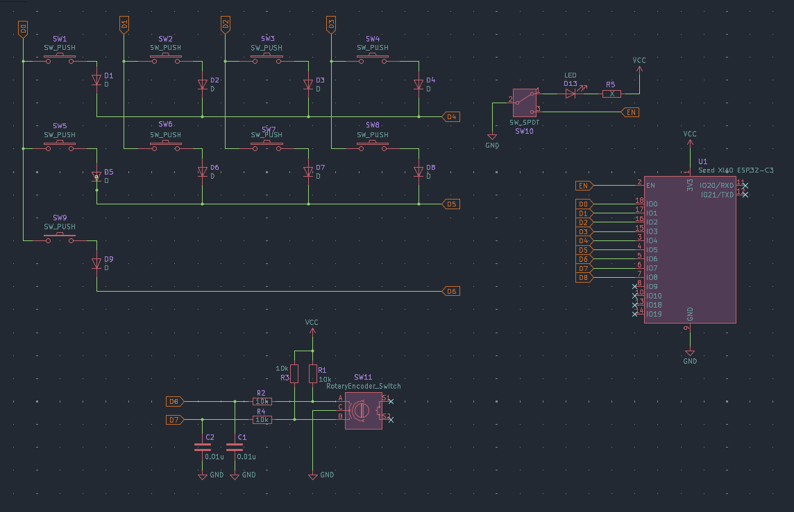

# Toopla10

作業で使用するために作成した9キーの片手キーボードです。  
マイコンにはXIAO ESP32-C3を採用し、小型かつ無線を実現しています。

<!-- 制作記事は[**note**]()に上がっているので、気になる方は参照してください。 -->

## 回路

[KiCadのプロジェクトファイル](./KiCad.zip)



このキーボードでは、4x3のキーマトリクスを採用しています。  
私は9キー分実装しましたが、最大12キーまで実装可能です。

回路図ではスイッチ内臓のロータリーエンコーダーを使用していますが、実際に制作した基板ではスイッチなしのものを使用しました。  
そのため、回路図上では結線を行っていませんが、内蔵スイッチをマトリクスにつなげることで同じキーマップで制御可能です。

回路図では記載がありませんが、XIAO ESP32-C3にはバッテーリー端子があります。  
3.7vのリポバッテリーを接続することで、完全に無線で動作できます。  
また、USB端子から充電も可能です。

## キーマップ

プログラム全体は[**こちら**](./toopla.ino)を参照してください。

### ロータリーエンコーダーのマップ

ロータリーエンコーダーのキーマップは以下の配列で行います。

```ino
const unit8_t encoderMap[2] = {"'", "-"} // left, right
```

左回転、右回転の順番で指定します。

### 12キーのマップ

キーマップの設定は以下の配列で行います。

```ino
const Shortcut keyMap[rowNum][colNum] = {
  { { 0, 'a' }, { MOD_CTRL, 'c' }, { 0, 0 } },  // 1 5 9
  { { 0, 'b' }, { MOD_CTRL, 'v' }, { 0, 0 } },  // 2 6 10
  { { 0, 'c' }, { MOD_CTRL, 's' }, { 0, 0 } },  // 3 7 11
  { { 0, 'd' }, { 0, 0 }, { 0, 0 } }            // 4 8 12
};
```

配列の左側では修飾キーを指定し、右側ではキーコードを指定します。  
指定せず、何も送信しない場合は`0`を指定します。

また、修飾キーを2つ以上指定する場合は以下のように書きます。

```ino
{MOD_CTRL | MOD_ALT, 'z'}
```

指定できる修飾キーは以下のリストのとおりです。  
※Windows基準です。
| キーコード | 種類 |
| - | - |
| MOD_CTRL | 右 Ctrl |
| MOD_SHIFT | 右 Shift |
| MOD_ALT | 右 Alt |
| MOD_GUI | Windowsキー |

また、BleKeyboardでは次のように指定されているため、上記のリストのとおりに指定する必要はありません。

```h
const uint8_t KEY_LEFT_CTRL = 0x80;
const uint8_t KEY_LEFT_SHIFT = 0x81;
const uint8_t KEY_LEFT_ALT = 0x82;
const uint8_t KEY_LEFT_GUI = 0x83;
const uint8_t KEY_RIGHT_CTRL = 0x84;
const uint8_t KEY_RIGHT_SHIFT = 0x85;
const uint8_t KEY_RIGHT_ALT = 0x86;
const uint8_t KEY_RIGHT_GUI = 0x87;
```

## パーツリスト

[CSV](./parts.csv)

| 記号     | 定数               | 個数 | 備考                    |
| -------- | ------------------ | ---- | ----------------------- |
| U1       | Seed XIAO ESP32-C3 | 1    | マイコン                |
| R1,R3    | 10k                | 4    | エンコーダー プルアップ |
| R2,R4    | 10k                | 4    | エンコーダー フィルター |
| R5       | X                  | 1    | LEDの制限抵抗           |
| C1,C2    | 0.01u              | 2    | エンコーダー フィルター |
| D1～D9   | 1N4148             | 9    | スイッチ逆流防止        |
| D13      | LED                | 1    | なんでも                |
| SW1～SW9 | SW_PUSH            | 9    | メインスイッチ          |
| SW10     | SW_SLIDE           | 1    | 電源用スイッチ          |
| SW11     | RotaryEncoder      | 1    | ロータリーエンコーダー  |

R5はLEDの制限抵抗ですので、任意の値を選んでください。  
電子パーツはすべて[**秋月電子通商**](https://akizukidenshi.com/catalog/default.aspx)で購入可能です。
